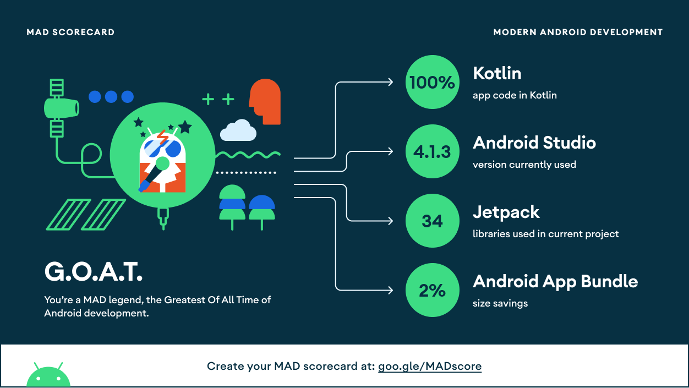

<h1 align="center">Digging Coroutine</h1>

  

  
  

 

## :information_source: Sobre

Este é um projeto educativo aonde exploro um pouco sobre coroutinas que são usadas no desenvolvimento Android.

Aqui conseguiremos ver como elas funcionam, e seu fluxo de funcionamento.

 

## Fundação

- [Coroutines](https://developer.android.com/kotlin/coroutines) - Performing asynchronous code with sequential manner.
- [Koin](https://insert-koin.io/) - The DI framework.
- [Retrofit](https://square.github.io/retrofit/) - A type-safe HTTP client for Android
- [OkHttp](https://square.github.io/okhttp) - Request interceptors. Pipeline before remote API call.
- [Fragment](https://developer.android.com/guide/fragments) - The UI host.
- [View Binding](https://developer.android.com/topic/libraries/view-binding) - Providing safe access to view. 
- [ViewModel](https://developer.android.com/topic/libraries/architecture/viewmodel) - Presenter with its semi data persistence behavior.
- [Navigation component](https://developer.android.com/guide/navigation/navigation-getting-started) - The key player for adopting single-activity architecture with ease.
- [ConstraintLayout](https://developer.android.com/reference/androidx/constraintlayout/widget/ConstraintLayout) - Helping me manage positioning & alignment with ease. 

 

## Em andamento

- [UnitTests](https://kotlin.github.io/kotlinx.coroutines/kotlinx-coroutines-test/)
- [UiTests](https://developer.android.com/training/testing/espresso)

E algumas outras funcionalidade, arquitetura e padrões que ainda quero adicionar :)

## Serviços adicionais

Para conseguir usar a parte de requisição, você terá que gerar uma chave para a api da newsapi. Você consegue gerar gratuitamente a chave no site deles.

https://newsapi.org/

 

## MAD Scorecard

 
 

---

<h4 align="center">
  Feito com ❤️ por Thiago M. Dolabella 👋️ <a href="mailto:thiago.dmont@gmail.com">Entre em contato!</a>
</h4>

  

